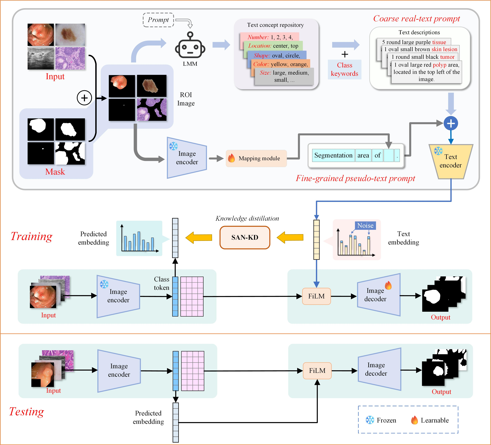

<!-- Improved compatibility of back to top link: See: https://github.com/othneildrew/Best-README-Template/pull/73 -->
<a id="readme-top"></a>
<!--
*** Thanks for checking out the Best-README-Template. If you have a suggestion
*** that would make this better, please fork the repo and create a pull request
*** or simply open an issue with the tag "enhancement".
*** Don't forget to give the project a star!
*** Thanks again! Now go create something AMAZING! :D
-->

<p align="center">
  <h2 align="center" style="margin-top: -30px;">Learning conceptual text prompts from visual regions of interest for medical image segmentation</h2>
</p>

 


## 📋 Overview

🌈This repository contains a official implementation implementation of our research paper “Learning conceptual textual prompts from visual regions of interest for medical image segmentation”. Our approach utilizes learning conceptual text from ROI images to assist the VLSM model for visual segmentation.

## Framework

<p align="center">
  
</p>

## 🛠️ Installation

### Setup Environment
```bash
# Create and activate conda environment
conda create -n vlsm python=3.10
conda activate vlsm

# Install dependencies
pip install -r requirement.txt
```
Refer to [pytorch.org](https://pytorch.org/) when installing torch packages.

<p align="right"><a href="#readme-top"></a></p>

### Datasets Links
| Dataset  | Download | Dataset  | Download 
|-------|-------|-------|-------|
| Kvasir | [Download](https://datasets.simula.no/kvasir-seg/) |DFU|[Download](https://dfu-challenge.github.io/dfuc2021.html) |
| BKAI | [Download](https://www.kaggle.com/c/bkai-igh-neopolyp/data) |ISIC|[Download](https://challenge.isic-archive.com/data/#2018) |
| CLinicDB | [Download](https://polyp.grand-challenge.org/CVCClinicDB/) |GLaS|[Download](https://paperswithcode.com/dataset/glas) |
| BUSI | [Download](https://scholar.cu.edu.eg/?q=afahmy/pages/dataset) |CAMUS|[Download](https://www.creatis.insa-lyon.fr/Challenge/camus/databases.html) |
| DDTI | [Download](http://cimalab.unal.edu.co/?lang=en&mod=project&id=31)  |ACDC|[Download](https://www.creatis.insa-lyon.fr/Challenge/acdc/databases.html) |

<p align="right"><a href="#readme-top"></a></p>

### Dataset Preparation

Please prepare the dataset in the following format to facilitate the use of the code:

```angular2html
├── data_process
   ├── kvasir
   │   ├── images
   |   |   
   │   ├── masks
   |   | 
   │   └── ROIs
   |  
   └── clinicdb
       ├── images
       ......
```

The image names and their corresponding mask names for the training, validation, and test sets are stored in `train_data.csv`, `val_data.csv`, and `test_data.csv`, respectively, within the `data_process` folder.

Using mask labels to cover the original images to get the ROI images:
```bash
python data_process/make_ROI_img.py \
    --dataset-name kvasir \
    --dataset-path data_process/kvasir \
    --img-format .jpg \ # Image Storage Format
```
For multi-category segmentation, please save each category label as a separate mask for each image and use the above code to make ROI images for it with corresponding number of categories.

<p align="right"><a href="#readme-top"></a></p>

### Models

- LLaVA-1.5 (`llava`: used to get textual attribute descriptions from ROIs)

  Since it is required to use the LLaVA model to perform inference on each ROI image, we strongly recommend localized deployment of the LLaVA model. Please [download](https://huggingface.co/liuhaotian/llava-v1.5-13b) the pre-training parameters and configuration files for the LLaVA model and place them in the `llava_inference/llava-v1.5-13b` folder.
- CLIPSeg(`clipseg`: model backbone)

  The pre-training parameters and files for the CLIPSeg model are automatically downloaded when running the segmentation code below. Alternatively, you can manually [download](https://huggingface.co/CIDAS/clipseg-rd64-refined/tree/main) and place them in the `model/pretrained` folder and then modify the `clipg_hf_api` parameter in `model/CoTexNet.py`.

### Generate Text

Using (LLaVA model + ROI images) to generate text for each dataset:
```bash
python get_text.py \
    --dataset-name kvasir \
    --model-path ./llava_inference/llava-v1.5-13b
```

<p align="right"><a href="#readme-top"></a></p>

## Training

Adjust the path and other hyperparameters in the `dataset_config/train_config.yaml` files before run the code.

```bash
python train.py
```
At the end of training, the model is automatically loaded with the best parameters selected based on validation results and evaluated on the test set.

## 📝 Notes

+ In the above "Generate Text", the code defaults to using GPUs 0 and 1 for inference (see the `os.environ['CUDA_VISIBLE_DEVICES']` parameter in `llava_vqa_13.py` for more details). Ensure that the total available GPU memory exceeds 28GB.
+ For the parameter `num_classes` in `dataset_config/train_config.yaml`, `num_classes` should be the number of categories plus one (with the background as a separate category). For example, in the CAMUS dataset (3 classes), `num_classes` is 4.

## 📄 LICENSE

This project is licensed under the MIT License - see the [LICENSE](LICENSE) file for details.

<p align="right"><a href="#readme-top"></a></p>
